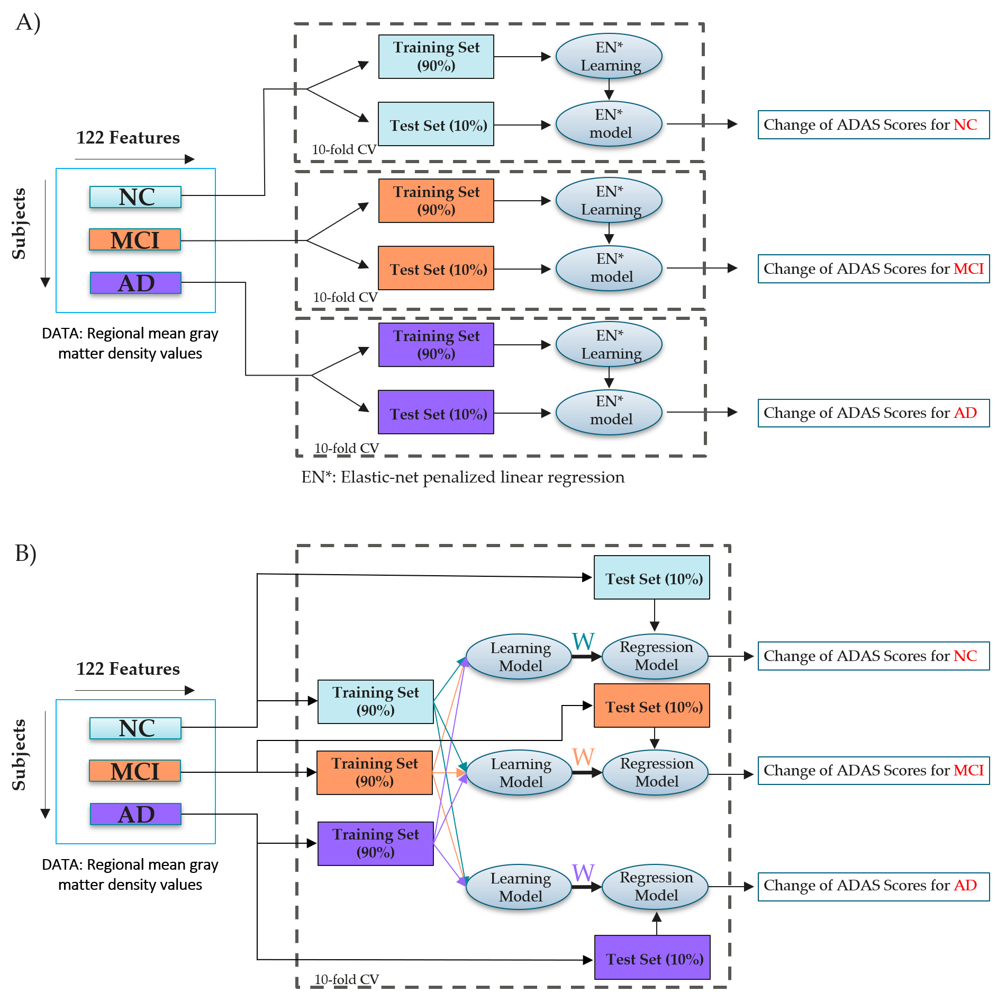

# ADAS_MRI (Single-task learning Vs Multi-task learning)

# Comparison of single and multi-tasklearning for predicting cognitive declinebased on MRI data. <br/> 

A Matlab implementation for predicting the change of ADAS scores using brain MRI with single and multi-task learning. In the present work, we compared single- and multi-task learning approaches to predict the changes in ADAS-Cog scores based on T1-weighted anatomical magnetic resonance imaging (MRI). In contrast to most machine learning-based methods to predict the changes in ADAS-Cog, we stratified the subjects based on their baseline diagnoses and evaluated the prediction performances in each group.

**Maintainer:** Vandad Imani, (Email:vandad.imani@uef.fi)<br/> 


**TABLE OF CONTENTS**
===================================
* [1.&nbsp;&nbsp;Introduction.](#introduction)
* [2.&nbsp;&nbsp;Software implementations.](#implementations)


# INTRODUCTION
Alzheimer’s Disease (AD) is a chronic neurodegenerative disorder that occurs among the elderly. AD's pathophysiological changes begin many years before clinical manifestations of disease and the spectrum of AD spans from clinically asymptomatic to severely impaired. Because of this, there is an appreciation that AD should not only be viewed with discrete and defined clinical stages but as a multifaceted process moving along a continuum. Therefore, early prediction of disease progression would be a crucial step towards designing proper therapeutic, unburden the health care system, and preventing adverse events caused by AD. Due to this reason predicting ADAS-Cog scores with machine learning in order to monitor and quantify patient conditions has been gaining research interest. These progression models come into two categories:  
(1) [Single-task learning.](Matlab/Single-Task/)  
(2) [Multi-task learning.](Matlab/Multi-task/) 



Single-task learning (STL), the disease progression of each individual group is predicted at different time-points independently (Figure A).
Multi-task learning (MTL), utilizes the essential similarities among various related tasks to predict disease progression. It improves the generalization performance by solving multiple learning tasks simultaneously while exploiting commonalities and differences across tasks (Figure B). 

# IMPLEMENTATIONS
## Package Usage:
Install Lasso and elastic-net regularized generalized linear models (Glmnet) from here: [Download](https://web.stanford.edu/~hastie/glmnet_matlab/download.html)

Install library for support vector machines (This used in cascade ensemble learning method) from here: [Download](https://www.csie.ntu.edu.tw/~cjlin/libsvm/) 

Install ComBat harmonization in Matlab from here: [Download](https://github.com/Jfortin1/ComBatHarmonization/tree/master/Matlab) 

Install the MALSAR (Multi-tAsk Learning via StructurAl Regularization) package which includes the MTL learning algorithms from here: [Download](http://jiayuzhou.github.io/MALSAR/) 

The directory containing data can be added to the Matlab path as follows:
```matlab
Datapath = '/path/to/the/data/folder';
```
In addition, the directory containing the mentioned packages can be added to the Matlab path as follows:

```matlab
addpath('../glmnet_matlab/');
addpath('../libsvm-3.22/matlab/');
addpath('../ComBatHarmonization/scripts/');

% Multi-Task Learning
addpath('../MALSAR/functions/');
addpath('../MALSAR/utils/');
```

## Single-Task learning

Elastic-net penalized linear regression

- [ALL-EN](Matlab/Single-task/ALL-EN)
   - Without Harmonization
   ```matlab
   % OUTPUT          : 
   % Results         : 'results','results_NC','results_MCI','results_AD','cor','MAE','cor_s','CorNC','CorMCI','CorAD','MAE_NC','MAE_MCI','MAE_AD'
   % INPUT           :
   % Datapath        : The directory containing data
   % Harmonization   : 0- Without data monization, 1- ComBat harmonization, 2- PLS-based domain adaptation  
   % Covariate       : 0- Without considering Age as covariate, 1-With considering Age as covariate
   %--------------------------------------------------------------------------------------------------------------------------------------------
   %--------------------------------------------------------------------------------------------------------------------------------------------
   Datapath       = '/path/to/the/data/folder';
   Harmonization  = 0;
   Covariate      = 0;
   ALL_EN(Datapath,Harmonization,Covariate)
   
   ```
   - [ComBat+ALL-EN](Matlab/Single-task/ALL-EN)
   
     ```matlab
        Datapath       = '/path/to/the/data/folder';
        Harmonization  = 1;
        Covariate      = 0; Or 1
        ALL_EN(Datapath,Harmonization,Covariate)
   
      ```                  
   - [PLS-Based Domain adaptation](Matlab/Single-task/ALL-EN)

     ```matlab     
         Datapath       = '/path/to/the/data/folder';
         Harmonization  = 2;
         Covariate      = 0; Or 1
         ALL_EN(Datapath,Harmonization)     
     ```
- [Cascade Ensemble Learning](Matlab/Single-task/Cascade Ensemble Learning/) 
Therefore, \cite{moradi2017predicting} suggested a two-stage strategy, where in the first stage, a PLS-based domain adaptation is performed for each brain region separately ,and then, for each brain region, the prediction task is performed. These predictions are then combined in the stacking framework. We applied AAL-atlas to decompose the gray matter density values into 122 distinct regions. For the prediction $\Delta ADAS$ for each brain region, we utilized support vector regression (with a radial basis function kernel)  as suggested in \cite{moradi2017predicting}. Finally, the per-region predictions were combined using the elastic-net penalized linear regression described in Section~\ref{Penalized_linear_regression}.    


## Multi-Task learning
